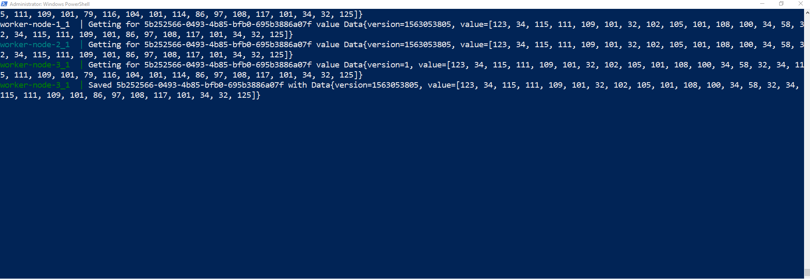

# network-algorithms-leaderless
university/network-algorithms/leaderless

## In order to build you need to have installed

  * Java 8
  * DockerToolbox
    
## To build and run    
   * './gradlew clean build' - to compile everything.

   * 'docker build --tag leaderless-dm/node:0.1.0 ./node --rm=true' 
   -to build the docker images for node
     It is not required to publish the docker image.
   
   * 'docker-compose up' - to run the cluster

At this version change in MainService.java in client module to point to your docker http://{dockerip}:808X/.
Currently 3 nodes are exposed on ports 8080,8081,8082.

```
 private List<String> nodes = ImmutableList.of("http://192.168.99.100:8080/", "http://192.168.99.100:8081/",
            "http://192.168.99.100:8082/");
```


## How it works

Client writes to all nodes at the same time async. If n/2 +1 nodes succeded the write is considered successfull.
Clinet reads from all nodes at the same time async. If n/2 +1 nodes succeded the read is considered successfull.
Result is obtained based on majority principle. All nodes that returned outdated results are updaded with the right alue asynchronous mode.

## some screenshots

From the following screenshot you can observe node 3 returned an outdated value based on majority. 
The node 3 is immediately updated with the right value.




