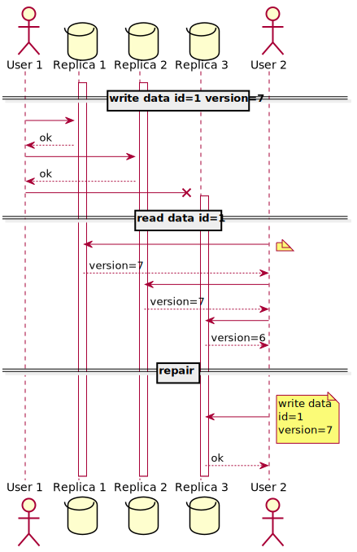

# Replicarea fară lider
Replicarea cu lider este bazată pe ideea ca un client face cereri de scriere a datelor la un singur nod (liderul) și sistemul de bază de date are grijă să copie acea scriere in alte noduri (replici).
Liderul determină ordinea in care cererile de scriere a datelor vor fi procesate și nodurile replică aplică scrierele in aceași ordine.

Unele baze de date au o altă abordare renunțând la princiul de "lider" și permit nodurilor de replică sa accepte singure cereri de scriere a datelor.
La început existau doar bazele de date cu replicare doar fara lider. Ele au fost uitate, lăsate baltă deoarece sistemele de gestiune a datelor relationale au devenit dominante.
Odată cu "cloud computing" și importanța scalării sistemelor de baze de date replicarea fară lider redevine din nou la modă.
Amazon a dezvoltat baza de date Dynamo. După apar și variante open-source ca Riak, Cassandra și Voldemort ca și Dynamo toate cu sistem de replicare fară lider.

În unele implementări de replicare fară lider, clientul face cereri de scriere la cîteva noduri de replica, în timp ce altele, un nod cordonator face acest lucru în locul clientului. Însa nodul coordonator nu este un lider pentru ca nu impune reguli și ordinea de procesării a cererilor de scriere.

## Scrierea datelor cînd un nod este căzut
Sa ne imaginăm o bază de date cu trei replici, și un nod este innacesibil (poate repornește sau instalează o actualizare critică de sistem).

Figura 1.1 ne arată ce se intâmplă:
Clientul trimite o cerere de scriere la toate trei noduri replici în paralel și doua noduri accesibile reușesc sa inregistreze cererea dar nodul innacesibil va rata această actualizare. Să considerăm două din trei noduri au înregistrat actualizarea, confirmând clientului, o scriere de succes.
Clientul va ignora ca un nod din replici nu a reușit sa scrie,nu a răaspuns la timp sau este innaccesibil.

Printro minune nodul innacesibil își revine, si clienții încep să citească din el. Toate scrierele care sau întamplat in timpul ce nodul a fost innaccesibil lipsesc din acest nod. Și citirele nu vor genera rezultate sau vor da rezultate învechite în răspuns.

Pentru a rezolva această problemă cînd clientul citește din baza de date clientul trebuie sa citească din toate nodurile de replică în paralel. Clientul poate să primească diferite versiuni cu valori diferite, valori adevarate de ultimă versiune și valori învechite sau chiar lipsă. Versiunea datelor indică daăa ele sunt recente (cele bune).
Implementarea sistemului de versiune are un impact la cum datele sunt indentificate fiind corecte (mai recente sau majoritare in sistem).

## Repararea immediată și anti-entropie

Sistemul de replicare trebuie să asigure că eventual toate datele sa fie copiate în fiece nod replică. Cînd un nod de  replică innaccesibil își revine el trebuie sa obțină toate actualizarile pe care lea pierdut.

În acest sens sau dezvoltat două mecanizme:

* Repararea immediată - Cînd un client citește din mai multe noduri in paralel, el poate detecta care noduri au valori invechite și poate să le repare. De exemplu in Figura 1.1 clientul User 2 obține versiunea a 6-a de date de la nodul Replica 3 și versiunea a 7-a de date de la nodurile Replica 1 și Replica 2. Clientul vede că nodul Replica 3 are o versiune invechită de date și va scrie in nodul Replica 3 o actualizare la versiunea 7-a de date.

* Anti-entropie - Baza de date are un proces continuu care va detecta diferențele dintre nodurile de replică și va copia orice actualizari lipsesc de la un nod la altul.
Acest proces anti-entropie nu aplica reguli sau copiere intr-o anumită ordine.

Aceste mecanizme pot fi aplicate împreuna sau individual.
De exemplu Amazon dynamo le conțtine pe ambele.
!!! Este important de precizat că lipsa unui process anti-entropie poate duce la un sistem care pierde date in timp. Și anume datele care sunt accesate foarte rar pentru că datele accesate mai des sunt reparate immediat.

## Quorum

În exemplul din Figura 1.1 am considerat scrierea cu succes deși a fost reușită doar pentru două din trei noduri replica.
Și invers doar un nod din trei poate fi innaccesibil sau la citire cu date invechite. Astfel putem fi siguri ca la citire cel putin un nod va avea date cu versiunea cea mai recentă.
În rezumat chiar de avem un nod cazut putem in continuare sa realizăm citiri care întorc cele mai recente date.

Să generalizam o scriere trebuie confirmata de un numar _w_ de noduri pentru a fi considerat un succes. O citire trebuie confirmata de un număr _r_ de noduri pentru a fi considerat un succes. Cît timp relația _w + r > n_ se respectă vom citi date care sunt la zi.
Numarul necesar de confirmari pentru operația de sriere sau citire se numeste Quorum unde w și r sunt numarul minim de voturi pentru a considera operaținea de succes.

De comun este ales _n_ un numar impar și _w = r = (n + 1)/2_
Acești parametri deobicei sunt configurabili și cu ei se pot obține diferite effecte, de exemplu: pentru un sistem cu scrieri puține multe citiri _w = n, r = 1 _ da o maximă performanță la citire, insă căderea unui singur nod duce la căderea baza de date integral.

Condiția _w + r > n_ garanteaza:
* dacă _w < n_ să procesăm scrieri chiar daca un nod este inaccesibil.
* dacă _r < n_ să procesăm citiri chiar daca un nod este inaccesibil.
* dacă nodurile accesibile sunt mai puține decât _r_ sau _w_ toate citirile și scrierile vor da erori.

Un nod de replică poate cadea din mai multe motive: probleme hardware, oprit, o eroare la execuția de operțiuni (de exemplu un disk plin), din cauza căderii rețelei între client si nodul replică, etc. 
Dacă un nod nu poate raspunde cu succes la operațiuni el este considerat inaccesibil oricare ar fi motivul căderii lui.

# References
[1] Martin Kleppmann : "Designing Data - Intensive Applications", March 2017 